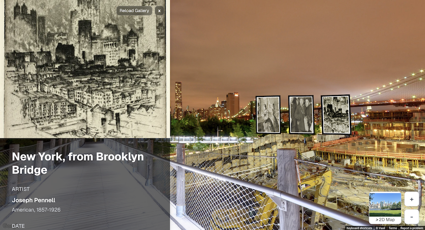

# ArtMap

**Bridging Art and Geography Through Immersive Exploration**

ArtMap transforms Google Maps into a global art discovery platform, allowing users to explore artworks in their original cultural and geographical context.

## ✨ Features

* **Global Art Discovery**: Search and explore artworks from different periods and locations worldwide
* **Interactive 3D Galleries**: Experience art in immersive 3D galleries that respond to Street View perspective changes
* **Cultural Context**: Walk through locations via Street View while browsing locally-relevant artworks
* **Time & Place Connection**: Discover how geography and culture shaped artistic expression across centuries

## 🚀 Key Innovation

Custom integration between Google Street View and Three.js, featuring real-time coordinate system transformations that synchronize 3D gallery positioning with Street View camera movements - a first-of-its-kind implementation.

## 🛠️ Built With

* **Frontend**: Next.js, React.js, JavaScript/TypeScript
* **Maps & Location**: Google Maps API, Street View API, Places API, Geocoding API
* **3D Graphics**: Three.js, React Three Fiber, WebGL
* **Art Data**: Art Institute of Chicago API, Elasticsearch
